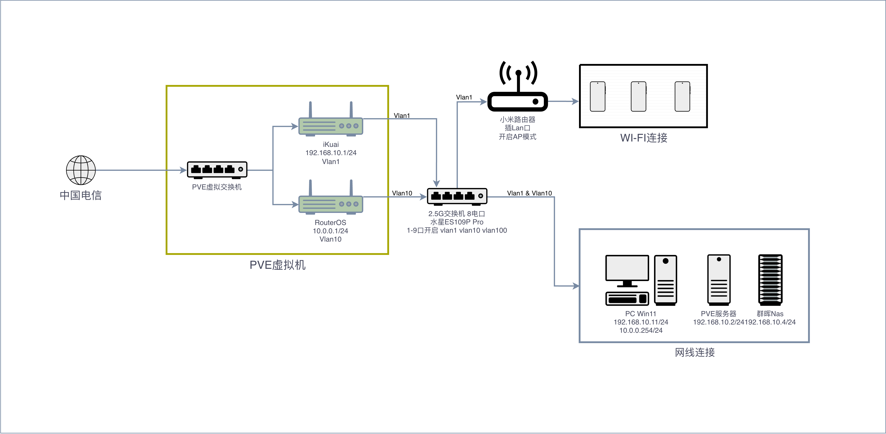
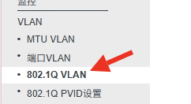
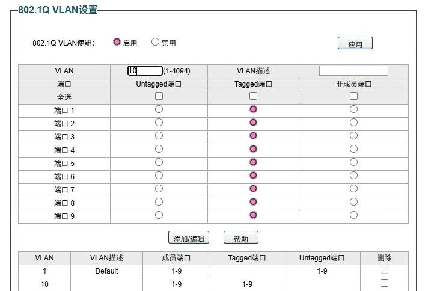
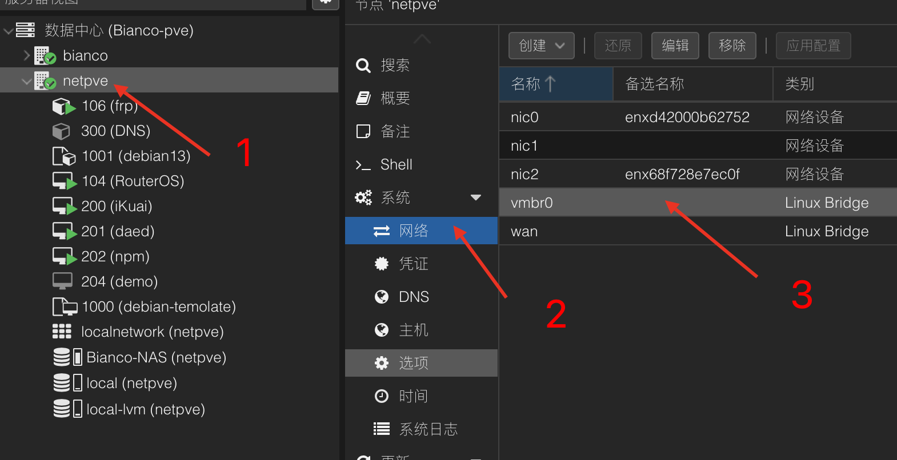
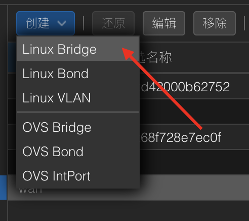
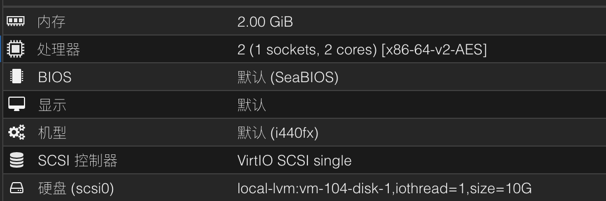
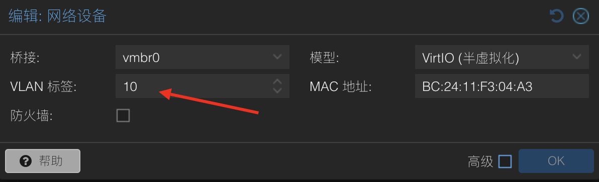
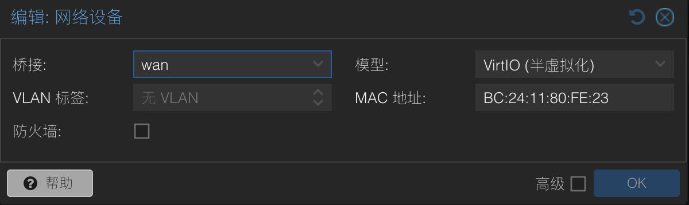

### 前言
> 因为朋友的安利，一直想试试传说中的路由器系统 RouterOS（以下简称 ROS ），但是我之前用的是 ikuai 的系统，如果直接换 ROS ，怕是会影响现有网络环境的稳定性。于是我决定用 Pve虚拟机 + VLAN 在现有网络环境中搭建一个独立的 ROS 测试环境，本文记录了我在这个过程中遇到的问题和解决方案。

### 我的设备
- N100 小主机（pve 虚拟机宿主机,安装 ikuai 做主路由）
- 水星SE109P Pro 2.5G 交换机（支持VLAN 802.1q）
- Pve服务器（作为测试环境中的访客机）

### 完成后的网络拓扑

### 设置交换机 VLAN
在设置 VLAN 之前，我们要先明确一个概念，在 VLAN 802.1q 中，有两种端口类型，分别是 Untagged 和 Tagged 。这两个端口类型的区别在于：
- Untagged 端口：不带 VLAN 标签的数据包，Tag 里没有 VLAN ID，通常用于终端设备（打印机等）。
- Tagged 端口：带 VLAN 标签的数据包，Tag 里包含 VLAN ID（如 10、20），一个端口可以承载多个 VLAN 。

理解了以上概念后，我们可以开始配置交换机的 VLAN 了。以下是我的配置步骤：
1. 登录交换机管理界面，进入 VLAN 802.1q 设置页面。

2. 启用 VLAN 功能，创建一个 VLAN ID 为 10 的 VLAN ，端口全部选择 Tagged 。（我这里会默认创建一个 VLAN ID 为 1 的 VLAN ，所有没有 VLAN 标签的数据包会默认走这个 VLAN）

3. 保存设置。

这样我们就完成了交换机的 VLAN 设置，接下来我们需要在 Pve 虚拟机中配置 VLAN 接口，以便让 ROS 能够识别和使用 VLAN 。

### 配置 Pve 虚拟机 VLAN 接口
1. 登录 Pve 管理界面，进入网络设置页面，找到 Pve 的虚拟交换机，一般默认是 vmbr0。

2. 点击编辑，把 “VLAN 感知“ 选项勾选上，保存设置。

3. 点击应用配置

下面的操作需要你家宽带可以多播 IP ，如果是单 IP 的话，可以跳过这一步！
4. 创建宽带入网虚拟交换机

5. 名称随意，桥接端口填插到你家光猫的那个网卡接口，我这里是 nic2。

6. 创建并且点击应用配置。

至此，我们的 Pve 虚拟机 VLAN 接口配置完成，接下来我们就可以创建 ROS 虚拟机了。

### 创建 ROS 虚拟机
1. 下载 ROS 官方镜像，并上传到虚拟机，镜像下载地址：https://mikrotik.com/download?architecture=x86
2. 创建虚拟机，选择刚刚上传的 ROS 镜像作为安装介质，配置虚拟机的 CPU、内存等参数。（这里我放一张我的配置供参考）

3. 启动虚拟机，进入 ROS 安装界面，按照提示完成安装。

完成安装后，关闭虚拟机，进行最重要的网络接口配置。
- 修改默认创建的 net0 ，修改其中的 VLAN 标签为 10 。

- 添加一个新的网络接口 net1，这个接口默认设置，不用修改。
- 再添加一个网络接口 net2，桥接到刚刚创建的宽带入网虚拟交换机上，我这里是 wan 。（PS：这一步需要你家宽带可以多播 IP ，如果是单 IP 的话，可以跳过这一步！）

为什么我们在这里要设置三个网络接口呢？
- net0 接口：用于连接交换机的 VLAN 10 ，作为内网接口。
- net1 接口：用于内网设备与 ROS 之间的通信，没有这个接口当你配置玩 ROS 后，内网设备（VLAN 1 中的设备）将无法与 ROS 通信。当然如果你不支持宽带多播那这个接口也是 ROS 的入网接口。
- net2 接口：用于连接外网，获取公网 IP 。（需要宽带支持多播）

### 结语
至此，我们就完成了 ROS + VLAN 测试环境的基础搭建，下一篇文章我将介绍如何配置 ROS ，实现 VLAN 10 设备的上网功能。如果你在搭建过程中遇到任何问题，欢迎在评论区留言讨论！